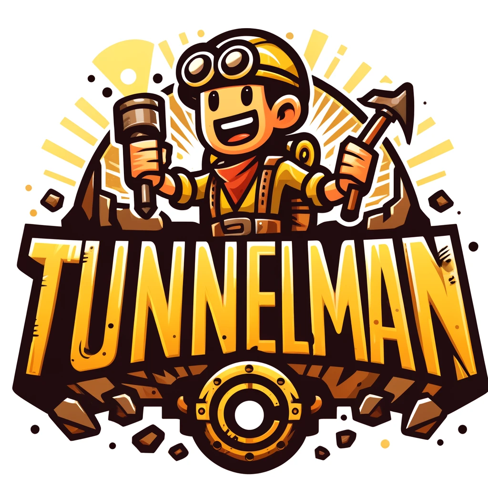

# Tunnelman Game



## Overview
The **TunnelMan Project** is a game developed in C++ where players navigate through various underground levels while overcoming obstacles. The game uses custom-built classes and a robust game engine to manage player movement, objects, and interactions. This guide will help you set up the environment and run the game locally.

## Features
- Player navigation through underground tunnels
- Handling objects like boulders, squirts, and pickups
- Managing interactions with obstacles and enemies
- Level progression system
- Custom class hierarchy including actors like TunnelMan, Boulders, and Protesters


## Video Demonstration
https://www.youtube.com/watch?v=Ks8YXHNCtBQ

# TunnelMan Project Setup Guide

This guide will walk you through the steps to set up, install dependencies, and run the TunnelMan game project using C++ and Visual Studio.

## Prerequisites

Before you begin, ensure you have the following installed on your machine:
- [Visual Studio](https://visualstudio.microsoft.com/) (with C++ development tools)
- A C++ compiler compatible with Visual Studio (typically included with Visual Studio)

---

## Step 1: Set Up the Development Environment

1. **Install Visual Studio**:
    - Download and install [Visual Studio](https://visualstudio.microsoft.com/) from the official website.
    - Ensure that the "Desktop development with C++" workload is selected during the installation process.

2. **Clone the TunnelMan Repository**:
    - Open Visual Studio.
    - Navigate to `File -> Clone or check out code` and clone the TunnelMan repository from GitHub.
      ```bash
      git clone https://github.com/YourUsername/TunnelMan-Game.git
      ```

3. **Open the Project in Visual Studio**:
    - Once the repository is cloned, open the solution file (`TunnelMan.sln`) located in the root directory.
    - Visual Studio will load the project and set it up.

---

## Step 2: Install Dependencies and Configure the Project

1. **Ensure Proper Libraries Are Installed**:
    - Confirm that you have the necessary libraries (e.g., graphics, audio, etc.) installed for the game to run.
    - If any libraries are missing, Visual Studio will prompt you to install them automatically.

2. **Set the Startup Project**:
    - In Visual Studio, right-click on the `TunnelMan` project and select **Set as Startup Project**.
    - This ensures that the correct project is run when you start debugging.

3. **Configure Build Settings**:
    - Open the **Project Properties** by right-clicking the `TunnelMan` project.
    - Under **Configuration Properties -> General**, ensure the configuration is set to `Debug` and the platform to `x64`.
    - Under **Linker -> Input**, verify that all required `.lib` files are linked correctly.

---

## Step 3: Run the Game

1. **Build the Solution**:
    - Press `Ctrl+Shift+B` or navigate to **Build -> Build Solution**.
    - This will compile the project and ensure there are no errors.

2. **Run the TunnelMan Game**:
    - After building the solution, press `F5` or click on **Start Debugging** to launch the game.
    - The TunnelMan game window should appear, allowing you to play the game.

---

## Step 4: Game Controls and Mechanics

### Player Controls
- **Arrow Keys**: Move TunnelMan around the level
- **Spacebar**: Use squirt gun to attack enemies
- **Escape**: Pause the game
- **Collect Pickups**: Collect items like water or sonar to help TunnelMan progress through levels

### Obstacles
- **Boulders**: Can be pushed but will fall and obstruct paths
- **Enemies**: Avoid or eliminate enemies using the squirt gun

---

## Step 5: Common Issues and Fixes

### Common Build Issues:
- **Missing Libraries**: If you receive errors about missing libraries, ensure that all required dependencies are installed and linked in the project properties.
- **Linker Errors**: Double-check the linker settings under **Project Properties -> Linker -> Input** to ensure all necessary libraries are linked.

### Runtime Errors:
- **Game Crashes on Start**: Ensure that all resources like audio, textures, and fonts are correctly located in the `Resources` directory of the project.

---

## Step 6: Advanced Configuration (Optional)

If you want to further customize the project, here are some advanced steps:

  
1. **Extend Classes**:
    - You can extend existing classes (e.g., TunnelMan, Boulder, Protester) by adding new behaviors or interactions.

---

## Conclusion

You have successfully set up the **TunnelMan Project** using Visual Studio and C++. You can now develop, test, and enjoy the game locally. 

For any issues, refer to the documentation or seek help from the community.

